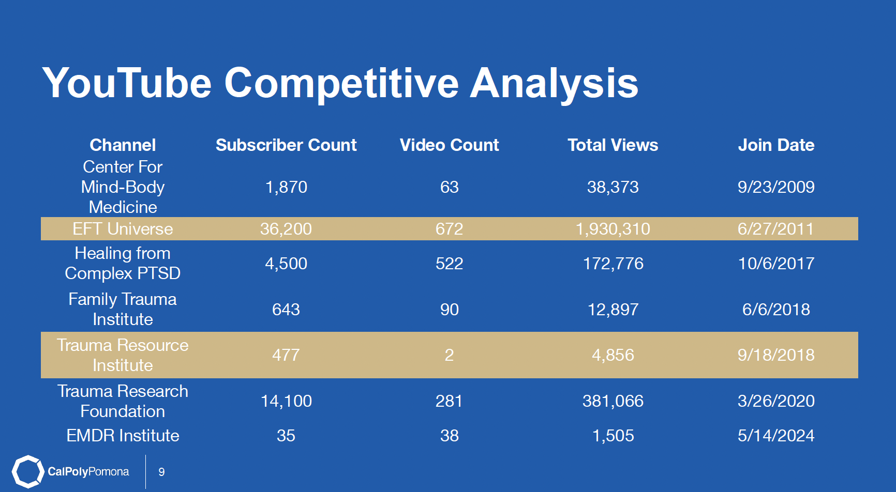

# Digital Marketing Projects

This page highlights some of my digital marketing work, with a focus on strategy, SEO, content planning, and nonprofit marketing initiatives.

---

## Trauma Resource Institute — YouTube Strategy & Nonprofit Marketing

This project involved developing a full digital marketing strategy for a nonprofit organization focused on trauma-informed care. The goal was to increase awareness, improve audience engagement, and support training conversions through YouTube and content marketing.

---

### Key Contributions

- Developed a YouTube content strategy focused on educational and conversion-driven content  
- Conducted competitive analysis across trauma and mental health channels to identify gaps and opportunities  
- Defined target audience segments including therapists, mental health professionals, and organizations  
- Created a full content roadmap including video topics, formats, and publishing strategy  
- Proposed affiliate marketing integration to support long-term revenue growth  
- Applied SEO and content optimization strategies to improve discoverability  

---

### Strategic Work

**Content Strategy**
- Designed a YouTube series: *“Resilience in Practice”*  
- Created episode-level breakdowns, messaging, and content themes  
- Developed a weekly content schedule for consistent audience engagement  

**Audience & Positioning**
- Positioned TRI as an accessible, educational resource for trauma-informed care  
- Focused on professionals seeking practical tools and training  

**Competitive Analysis**

To evaluate TRI’s position in the market, I analyzed competing YouTube channels based on subscriber count, video volume, and total engagement.

  

Key insights:

- Leading competitors had significantly higher content volume, not just larger audiences  
- Consistent publishing and structured content played a major role in growth  
- TRI had strong subject-matter authority but minimal content presence  
- There was a clear opportunity to grow through educational, series-based content  

These insights directly informed the content strategy and positioning recommendations.

**Marketing Strategy**
- Recommended integrating YouTube with website and social platforms  
- Proposed affiliate links and CTAs to support course conversions  
- Connected content strategy to broader business goals (awareness + revenue)  

---

### What I Learned

- How content strategy directly supports business and nonprofit objectives  
- The importance of aligning content with audience intent and search behavior  
- How platform strategy (YouTube + SEO + social) works together as a system  
- How to move from ideas → structured, executable marketing strategy  

---

> Visual placeholder: Add YouTube thumbnails, series mockups, or slides from the project

---

## Off-Page Social Media SEO — Trauma Resource Institute

This project focused on improving TRI’s online visibility through off-page SEO and social media optimization across platforms like Facebook, Instagram, and LinkedIn.

**Key Contributions**
- Optimized social media content using keyword strategies  
- Improved engagement through stronger post structure  
- Used backlinks and analytics tools to refine performance  

**Skills Developed**
- Off-page SEO strategy  
- Social media optimization  
- Engagement analysis  
- Data-driven content refinement  

> *(Visual placeholder: Add engagement charts or social media examples here later)*

---

## YouTube Content Strategy — Trauma Resource Institute

As part of the TRI project, I contributed to developing content ideas for YouTube focused on educational storytelling and audience engagement.

**Key Contributions**
- Proposed educational video concepts to build awareness  
- Connected content ideas to SEO and audience intent  
- Focused on conversion-driven content strategy  

**Strategic Takeaways**
- Educational content builds trust and awareness  
- Video content increases engagement  
- SEO improves discoverability  
- Content must connect to business goals  

> *(Visual placeholder: Add sample video ideas or content calendar here later)*

---

## Why These Projects Matter

These projects matter because they allowed me to apply classroom concepts to a real organization. I strengthened my skills in digital strategy, SEO, content planning, and teamwork while gaining a deeper understanding of how marketing creates real business value.