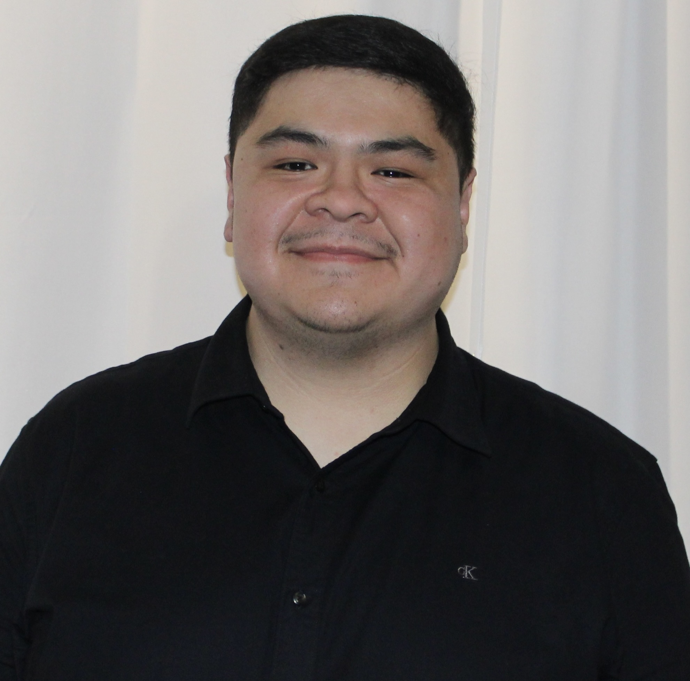

::: {.hero}

# Christian Gutierrez-Garcia

{width=220px .rounded-circle}

## Digital Marketing Student

Master’s student in Digital Marketing at Cal Poly Pomona with a strong interest in creative storytelling, digital strategy, and analytics. I am passionate about building a career in digital marketing within the film or sports industry.

My background combines creative thinking with data-driven decision making. Through academic projects and professional experience, I have worked on content strategy, SEO, analytics reporting, and digital campaign ideas that connect business goals with audience needs.

I enjoy work that sits at the intersection of creativity and performance. Whether I am developing content ideas, analyzing user behavior, or presenting insights, I aim to create work that is both visually compelling and strategically impactful.
:::

---

## Selected Work

### Rising Stars Muay Thai (Culminating Experience Project)
Developed a marketing analytics project focused on emerging Muay Thai fighters. Analyzed audience growth, engagement patterns, and digital visibility to generate insights on performance trends and brand development.

### Trauma Resource Institute (TRI) – YouTube Strategy
Collaborated on a digital marketing project to develop a YouTube content strategy aimed at increasing awareness and engagement. Focused on SEO optimization, audience targeting, and educational content planning for a nonprofit organization.

### Marketing Analytics Projects (SPSS & Tableau)
Completed multiple data-driven projects using SPSS and Tableau. Conducted statistical analysis, built dashboards, and interpreted results to support business decision-making and identify consumer behavior trends.

## About Me

I am currently pursuing a Master of Science in Digital Marketing at California State Polytechnic University, Pomona. I also hold a Bachelor of Science in Business Administration with a concentration in Marketing Management.

My professional experience includes working at Best Buy and completing a digital marketing micro-internship with the Trauma Resource Institute. Through these experiences, I developed skills in content planning, project coordination, analytics reporting, and digital strategy execution.

## Career Goals

My goal is to work in digital marketing within the film or sports industry, where I can combine storytelling, audience engagement, and data-driven strategy to create impactful campaigns.

## Core Strengths

- Content Strategy & Campaign Thinking  
- SEO & Digital Optimization  
- Data Analysis & Reporting  
- Marketing Analytics (GA4, Tableau, R)  
- Project Coordination & Workflow Support  
- Bilingual Communication (English & Spanish)

::: {.contact-box}
### Let's Connect

- [GitHub](https://github.com/gutichris18)
- Email: gutichris13@gmail.com
:::

