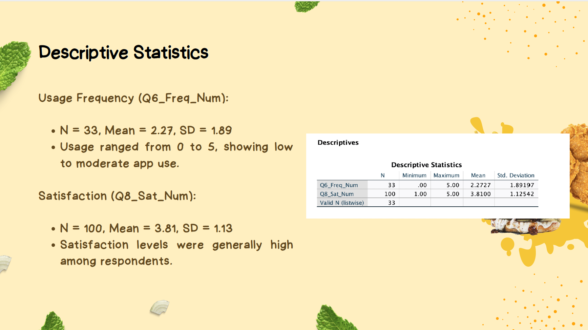
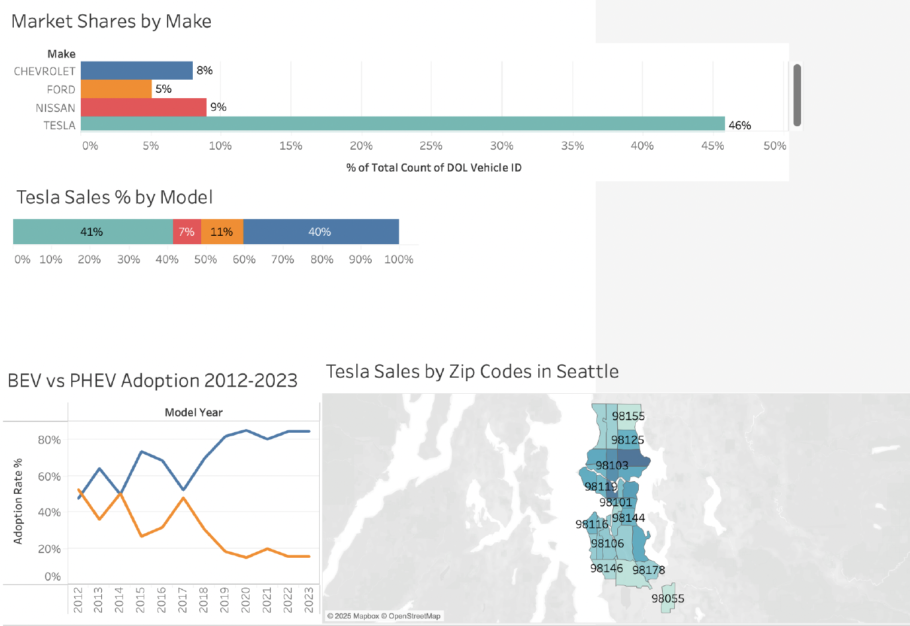
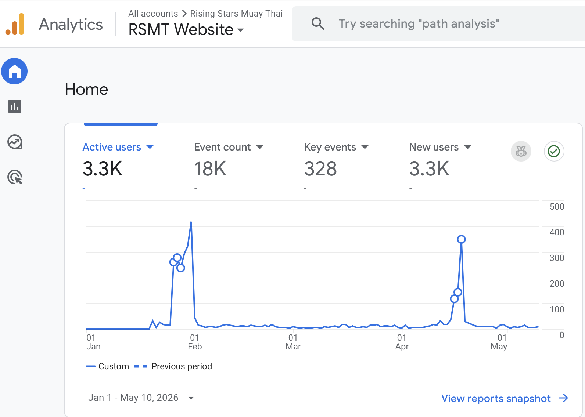

# Marketing Analytics Projects

This page showcases my work in data-driven marketing, including statistical analysis, data visualization, and business insights.

---

## Fast-Food Mobile App Satisfaction Study

This project analyzed whether customer satisfaction with fast-food mobile apps influences purchase behavior. Data was collected through Qualtrics and analyzed using SPSS.

**Objective**
- Determine if higher app satisfaction leads to increased purchase frequency  

**Methods Used**
- Logistic regression analysis  
- Descriptive statistics  
- Survey data analysis  

**Key Insights**
- App usability and convenience strongly influence purchase decisions  
- Customer satisfaction is positively associated with repeat purchases  

![Fast Food Mobile App Satisfaction Study Presentation Slide]
{width=65%}

*Project presentation slide summarizing descriptive statistics and customer satisfaction findings from survey data analysis conducted in SPSS.*

---

## Tableau Dashboard — Electric Vehicle Data

In this project, I created an interactive Tableau dashboard to explore trends in electric vehicle adoption.

**What I Did**
- Built visualizations to analyze adoption trends over time  
- Compared regions and usage patterns  
- Highlighted key insights for decision-making  

**Skills Demonstrated**
- Data visualization  
- Dashboard design  
- Insight communication  

{width=65%}

*Interactive Tableau dashboard analyzing electric vehicle adoption trends, Tesla sales distribution, and regional market patterns.*

---

## CEP Project — Rising Stars Muay Thai — Website Traffic Analysis (GA4)

As part of our culminating project, I implemented and analyzed Google Analytics 4 (GA4) tracking to better understand audience behavior, traffic acquisition, and engagement across the organization’s website and promotional campaign pages.

### Key Contributions

- Implemented GA4 tracking across the Rising Stars Muay Thai website using Google Analytics and Google Tag Manager
- Monitored acquisition channels including organic search, direct traffic, referral traffic, and social media traffic
- Analyzed engagement metrics such as sessions, engaged sessions, page views, and average engagement time
- Evaluated visitor interaction with event-related pages, ticket interest, and promotional content
- Used behavioral insights to improve website structure, navigation flow, and campaign visibility

### Analytics Focus Areas

- Traffic acquisition and channel performance
- User engagement and session behavior
- Event promotion performance and visitor interaction
- Organic discovery and search visibility
- Early-stage campaign optimization using analytics insights

### Tools & Platforms

- Google Analytics 4 (GA4)
- Google Tag Manager
- Google Search Console
- Quarto
- GitHub Pages

{width=65%}

---

## Why These Projects Matter

These projects demonstrate my ability to use data to support marketing decisions. I developed skills in statistical analysis, visualization, and interpreting data to generate meaningful business insights.